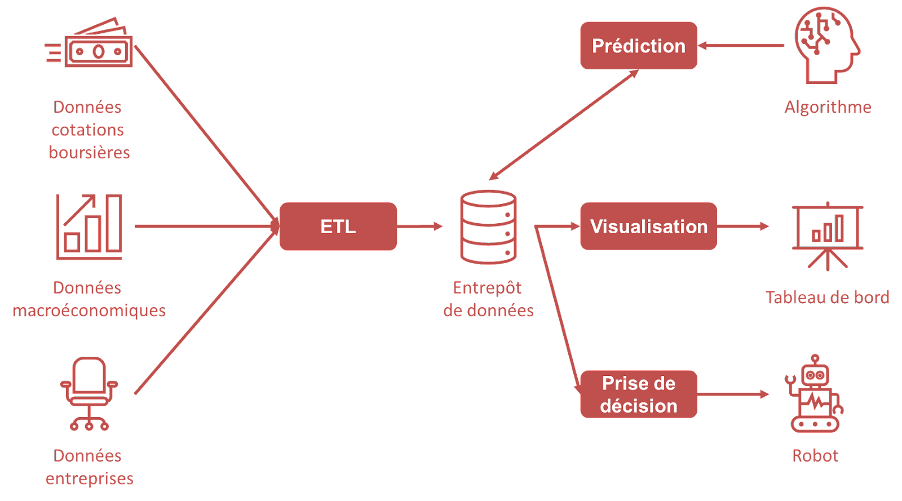

# Projet Robot Trader

## Introduction

### Contexte
Ce projet vise le développement d'un robot trader autonome qui utilise des données historiques de cotations boursières, des informations sur les entreprises, et des données macroéconomiques pour faire des prédictions et exécuter des transactions de manière autonome.

### Objectif
Créer un outil automatisé fiable, capable de prendre des décisions d'investissement éclairées grâce à des algorithmes de prédiction avancés.

## Définition du Projet
Nous envisageons un système intégré conçu pour optimiser les décisions d'investissement, exploitant la puissance des données et de l'automatisation. Ce système vise à prédire les mouvements du marché et à agir sur ces prédictions rapidement pour maximiser les rendements.

## Décomposition du Système

### Entrepôt de Données (Data Warehouse)
- **Objectif**: Centraliser et stocker les données pour une analyse rapide et efficace.
- **Outils**: Microsoft SQL Server.

### ETL (Extract, Transform, Load)
- **Objectif**: Automatiser la collecte, la transformation et le chargement des données.
- **Outils**: SSIS (SQL Server Integration Services).

### Tableau de Bord (Dashboard)
- **Objectif**: Fournir une interface visuelle pour le suivi des performances.
- **Outils**: Microsoft Power BI.

### Algorithme de Prédiction
- **Objectif**: Prédire les mouvements du marché et informer le robot des opportunités de trading.
- **Technologies**: Python avec TensorFlow ou Scikit-learn.

### Robot
- **Objectif**: Modéliser des transactions boursières basées sur les prédictions, dans un environnement contrôlé.
- **Fonctionnement**: Simulation d'achats et de ventes de titres avec un budget prédéfini.

## Portée du Projet

Ce projet personnel définira clairement les objectifs à atteindre, les éléments à développer, tout en délimitant les limites de ce qui sera réalisé.

### Données à Exploiter

- **Cotations Boursières Historiques**: Prix de clôture, prix d'ouverture, prix haut/bas, volume d'échanges, capitalisation boursière.
- **Informations sur les Entreprises**: Données financières, historique des dividendes, nouveaux contrats/partenariats.
- **Données Macroéconomiques**: Taux d'intérêt, taux de chômage, inflation.

## Fonctionnalités du Système

- Plateforme d'entrepôt de données.
- Processus ETL automatisé.
- Tableau de bord d'analyse.
- Algorithme de prédiction des mouvements du marché.
- Robot pour exécuter des transactions simulées.

## Livrables

- Entrepôt de données fonctionnel.
- Jobs SSIS configurés pour une exécution quotidienne.
- Tableau de bord Power BI opérationnel.
- Algorithmes de prédiction développés et testés.
- Robot trader prêt pour le déploiement.

## Spécifications Techniques

- **SSIS**: Intégration et transformation des données.
- **SQL Server**: Gestion de la base de données.
- **Power BI**: Visualisation des données.
- **Github Project**: Gestion du projet.
- **Python**: Développement des algorithmes.

## Conclusion

Ce cahier des charges définit la portée et les limites du projet pour maintenir une direction claire tout au long de l'initiative de simulation.

---

